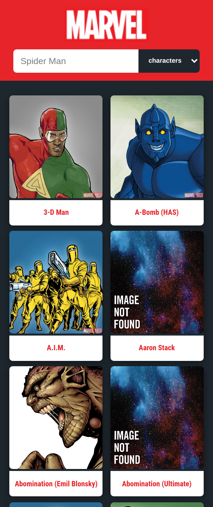

<p align="center">
  

  
  
  <a href="https://github.com/IgorTargino/podcastr/commits/master">
    
  </a>
    
   
  
</p>

## 🧐 Sobre o projeto

Uma aplicação que consome a api da Marvel e retorna uma lisa de personages ou séries, podendo também pesquisar pelo nome do personagem ou da série<br>

<a align="center" target="blank" href="https://marvel-spa.vercel.app/">
    
</a>

## 🎨 Layout

#### Figma: https://www.figma.com/file/mm5upc0jW8gBTZWNL7GRrc/marvel-spa?node-id=0%3A1
### Tela Desktop

<div align="center">
  
</div>

### Tela Mobile

<div align="center">
  
</div>

## ⚙️ Funcionalidades

- [x] Listagem de personagen;
- [x] Listagem de séries;
- [x] Busca por nome/title;
- [x] Responsividade
- [x] Paginação
  
## Como executar o projeto
### Pré-requisitos
- git 
- Node.js
- NPM ou Yarn
### Variáveis de Ambiente
Além das ferramentas anteriores é necessário criar duas váriaveis de ambiente no arquivo .env.local localizado na raiz do projeto.

NEXT_PUBLIC_API_KEY= PUBLIC_KEY <br>
NEXT_PRIVATE_API_KEY= PRIVATE_KEY

Também deverá gerar um hash no site md5hashgenerator e adicionalo á váriavel hash presente no arquivo /src/services/api.

hash = (timestemp + PRIVATE_KEY + PUBLIC_KEY)

obs: timestemp = ts = 1622102400599 ou você pode gerar o seu próprio ts com Date.now()

### Instalação
```
# Abra o terminal e copie este repositório com o comando
$ git clone https://github.com/IgorTargino/marvel-spa.git

# Acesse a pasta do projeto no prompt de comando 
$ cd marvel-spa

# Instale as dependências
yarn install
ou
$ npm install

# Execute a aplicação
$ yarn dev
ou
$ npm run dev

# Acesse http://localhost:3000 no seu navagador.

```
## 🚀 Tecnologias 
Tecnologias utilizadas para desenvolver o projeto:
- next.js
- react.js
  - SPA
- typescript
- context
- axios
- sass
- lottie


## 🦸‍♂️ **Autor**

<p>
 <sub><strong>🌟 Igor Targino Marinho🌟</strong></sub>
</p>

[](https://www.linkedin.com/in/igor-targino/)
[](mailto:igortargino01@gmail.com)
